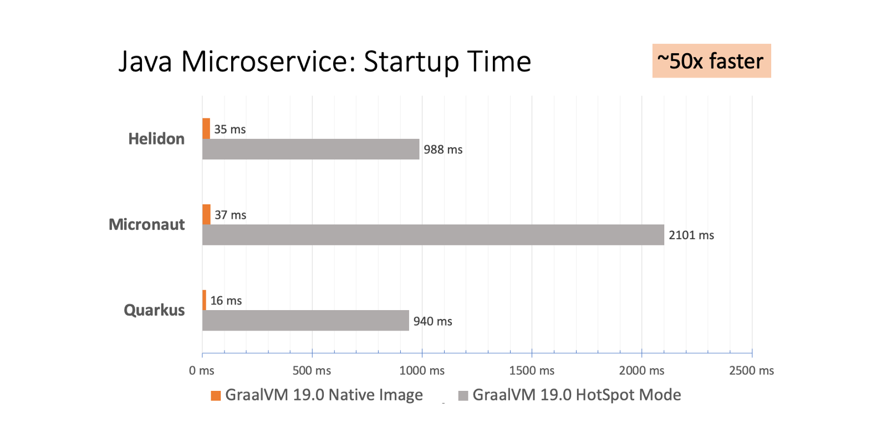

# GraalVM

GraalVMはHotspot/OpenJDKベースのJVMまたはJDKを指す. 

## 今の理解

コンパイルタイムに色々と最適化を施しているおかげでなんかよくわからんが早いらしい.

JVMアプリケーションのスタンドアローンで実行可能なバイナリを生成できるらしい.

> GraalVM has a feature to create native images for existing JVM-based applications. 

既存のJVMよりも立ち上げ/実行が早いらしい. JVMは長い間使われている分チューニングもモリモリされていそうなのにそれより早いとはどういうことだろうか.

## リサーチ

バイナリ化はgraalVMのサブプロジェクト`SubstrateVM`の機能. GraalVMは他にも様々な機能を提供する予定. 

### SubtrateVM
Javaで書かれたJavaのコンパイラ. 
コンパイラ自体の最適化が施されている. BoxingしたPrimitiveな型を箱からはがしたり.

実行するホストOSを指定したり、古いAPIを削除したり、GCを簡略化したりすることでパフォーマンス改善している. 実行ファイルはJVMナシで動く.

起動時間が遅いという部分がネックになるlamdbaだと速くなるが,JVM起動時間がそれほど重要ではなく,JITコンパイルの恩恵を受けやすい長時間動くプロセスはGraalVMを使ってもそれほど速くないらしい.

CLIツールを作るケースはGraalVMがかなり役立つだろう. 
実際作ってみた、という記事もいくつか見かけた.

- [ScalaとGraalVMでクリスマスっぽいAAをプリントするだけのCLIツールを作る](https://qiita.com/Satoooooooooooo/items/5b43ca1c18ed69784e6d)
- [Writing native CLI applications in Scala with GraalVM](https://msitko.pl/blog/2020/03/10/writing-native-cli-applications-in-scala-with-graalvm.html)

いたるところに**lihaoya**さんが出てきて驚いている. 

**lihaoya**さんしかり**martin odersky**さんしかりスーパープログラマの負担がエグいになってるなぁ、という顔をしている.

### GraalVM

PythonのコードをScalaから呼び出すことができるらしい.

後で試してみよう.

メモリフットプリントは5倍,起動は50倍程度効率がいいらしい.

### runtimeに動的に評価するコードはパフォーマンス改善されにくい＆エラーになりやすいらしい
コンパイルタイムによしなに最適化するのでランタイムにごにょごにょするコードは最適化しにくいらしい.

一部のJavaの機能は設定ファイルやオプションを追加することでJITではなくAOTでコンパイルできるらしい.

